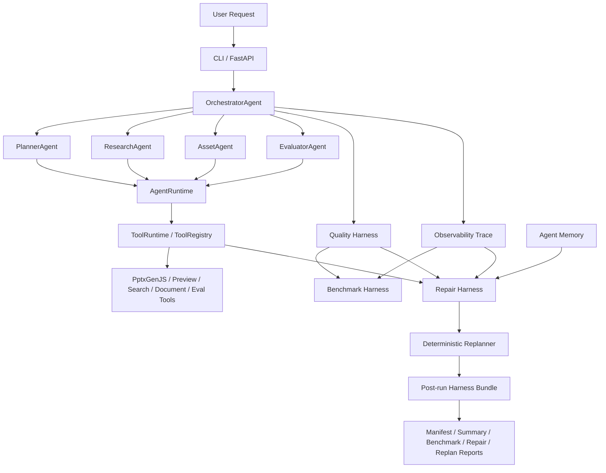

# PPT Generation Agent Harness

Evaluation-and-repair driven Agent Harness for document-to-PPT generation.

一个面向文档到 PPT 生成任务的 Agent Harness，用于执行受控 Agentic Workflow，
并统一管理 agent runtime、tool runtime、quality evaluation、observability、benchmark、
memory、repair 和 deterministic replanning。

## Project Positioning

This project is not a fully autonomous multi-agent system.
It is a controlled Agentic Workflow executed by a PPT Generation Agent Harness.

本项目不是完全自治式多 Agent 系统，而是一个主控式 Agentic Workflow。
Orchestrator 负责主流程，Planner / Research / Asset / Evaluator 是专职 agent-like workers。
Harness 负责统一 agent 执行、工具调用、质量评估、trace、benchmark、memory、repair 和 replanning。

The original CLI and FastAPI contracts remain the compatibility baseline.
The harness layers are added around the PPT generation path so generation, quality reporting,
traces, repair planning, replanning proposals, and post-run summaries can be inspected
without turning the backend into an autonomous agent society.

## Why Agent Harness Engineering

This repository focuses on the engineering boundary around a long LLM production chain:

- **AgentRuntime**: a unified `AgentSpec` / `AgentRequest` / `AgentResult` execution contract
  for planner, research, asset, and evaluator workers.
- **ToolRuntime**: a `ToolRegistry` / `ToolExecutor` layer for tool schema, timeout, retry,
  structured `ToolResult`, and stable `error_signature`.
- **Quality Harness**: run-level and slide-level quality reports written as `quality_report.json` and `quality_report.md`.
- **Observability**: structured trace events, `trace.jsonl`, and `trace_summary.json` / `.md`.
- **Benchmark Harness**: offline case evaluation over existing artifacts, including strict success rate,
  acceptable success rate, tool reliability, and error signature distributions.
- **Memory Harness**: JSONL-backed episodic, semantic, and procedural memory with lexical retrieval and repair memory compatibility.
- **Repair Harness**: deterministic repair issue extraction and repair plan/report generation from quality,
  trace, tool errors, and memory hits.
- **Deterministic Replanner**: auditable patch proposals over a PlanGraph,
  without letting an LLM freely reschedule runtime control flow.
- **Runtime Integration**: post-run manifest, bundle, and summary artifacts that gather the run into one reviewable package.

## Architecture



## Capability Map

| Layer | Module Path | Purpose | Key Artifacts |
|---|---|---|---|
| Quality Harness | `runtime/backend/harness/quality` | Run and slide quality metrics | `quality_report.json` / `.md` |
| ToolRuntime | `runtime/backend/harness/tooling` | Tool schema, execution, retry, timeout, `error_signature` | `ToolResult` |
| Observability | `runtime/backend/harness/observability` | Trace events and summaries | `trace.jsonl`, `trace_summary.json` |
| Benchmark | `runtime/backend/harness/benchmark` | Offline evaluation over run artifacts | `benchmark_report.json`, `case_results.jsonl` |
| AgentRuntime | `runtime/backend/harness/agent_runtime` | Agent execution contract and adapters | `AgentResult` |
| Memory | `runtime/backend/harness/memory` | Episodic, semantic, procedural memory | `outputs/memory` |
| Repair | `runtime/backend/harness/repair` | Repair issue extraction, planning, reporting | `repair_plan.json`, `repair_report.md` |
| Replanner | `runtime/backend/harness/orchestration` | Deterministic PlanGraph and patch proposals | `plan_graph.json`, `replan_decision.json` |
| Runtime Integration | `runtime/backend/harness/runtime_integration` | Post-run manifest, bundle, summary | `harness_manifest.json`, `harness_bundle.json` |

## Install

```bash
cd <your-local-checkout>
cp .env.example .env
uv sync
cd runtime
npm install
```

System dependencies:

- Node.js / npm: used by the PPT generation runtime and PptxGenJS.
- Optional LibreOffice and `pdftoppm`: used for PPT preview rendering and visual QA when available.

## CLI Usage

The main PPT generation path still uses the existing CLI:

```bash
uv run ppt-backend generate \
  --topic "大语言模型微调与对齐" \
  --min-slides 6 \
  --max-slides 8 \
  --image-mode off \
  --output-dir ./outputs
```

Document-based generation:

```bash
uv run ppt-backend generate \
  --topic "第三章 组合逻辑电路 - 教师授课 PPT" \
  --document /path/to/chapter.pdf \
  --min-slides 8 \
  --max-slides 14 \
  --output-dir ./outputs
```

Two-stage generation:

```bash
uv run ppt-backend outline \
  --topic "第三章 组合逻辑电路" \
  --document /path/to/chapter.pdf \
  --out ./outline.json

uv run ppt-backend from-outline \
  --topic "第三章 组合逻辑电路" \
  --outline ./outline.json \
  --image-mode off \
  --output-dir ./outputs
```

## Backend Service Mode

```bash
uv run ppt-backend serve --host 127.0.0.1 --port 8010 --output-dir ./outputs
```

Existing API surface:

- `GET /health`
- `POST /upload_document`
- `POST /generate_ppt`
- `POST /stream_ppt_outline`
- `POST /stream_ppt_from_outline`
- `POST /stream_evaluate/ppt`
- `GET /download_ppt/{filename}`
- `GET /preview_ppt/{filename}/{image_name}`

The post-run harness bundle is currently an internal helper.
It does not change the CLI or FastAPI response contracts.

## Post-run Harness Artifacts

A run may produce artifacts like:

```text
outputs/runs/{run_id}/
  quality_report.json
  quality_report.md
  trace.jsonl
  trace_summary.json
  trace_summary.md
  repair_plan.json
  repair_result.json
  repair_report.md
  plan_graph.json
  replan_decision.json
  replan_report.md
  harness_manifest.json
  harness_bundle.json
  harness_summary.md
```

`quality_report.*` and `trace_summary.*` are part of the core harness path when the generation flow reaches
those stages. Repair, replan, benchmark, memory, and runtime integration artifacts are optional and may be
generated by post-run helpers. Do not assume every artifact exists for every run.

Internal post-run helper:

```python
from backend.harness.runtime_integration import (
    build_default_post_run_config,
    run_post_generation_harness,
)

result = run_post_generation_harness(
    run_id="your_run_id",
    run_dir="outputs/runs/your_run_id",
    output_root="outputs",
    config=build_default_post_run_config(),
)
print(result.status)
```

Run this from an environment where `runtime` is on `PYTHONPATH` or through the project test/runtime setup.

## Benchmark

The benchmark harness lives in:

```text
runtime/backend/harness/benchmark/
```

It is an offline runner over existing artifacts. It reads `quality_report.json`, `trace_summary.json`,
and a benchmark suite JSON. It writes:

- `benchmark_report.json`
- `benchmark_report.md`
- `case_results.jsonl`

Core metrics include:

- strict success rate
- acceptable success rate
- PPTX exists rate
- preview success rate
- quality report exists rate
- trace summary exists rate
- average visual score
- average content issue count
- tool call success rate
- top error signatures
- missing artifacts

No benchmark numbers are claimed here. For a real project demo, paste the locally generated
`benchmark_report.md` summary into the table below.

| Metric | Baseline | Current | Delta |
|---|---:|---:|---:|
| Strict Success Rate | TBD | TBD | TBD |
| Acceptable Success Rate | TBD | TBD | TBD |
| Preview Success Rate | TBD | TBD | TBD |
| Tool Call Success Rate | TBD | TBD | TBD |
| Avg Visual Score | TBD | TBD | TBD |

## Boundaries and Limitations

- This is not a fully autonomous multi-agent system.
- The deterministic replanner proposes patches; it does not automatically apply them.
- The repair harness currently focuses on offline planning/reporting; it does not automatically modify PPT files.
- Memory uses JSONL plus lexical retrieval, not a vector database.
- Benchmarking is offline by default and does not invoke real generation.
- Runtime integration creates a post-run bundle; it does not take over the Orchestrator control flow.
- Optional Orchestrator hooks can be added later, but they should remain fail-soft and disabled by default.

## Resume Summary

Built a PPT Generation Agent Harness for document-to-PPT generation, with unified AgentRuntime, ToolRuntime,
quality evaluation, observability trace, offline benchmark, layered memory, repair planning,
deterministic replanning, and post-run harness bundles.

围绕文档到 PPT 生成任务，构建 Agent Harness 工程框架，统一 agent 执行、工具调用、质量评估、
trace、benchmark、memory、repair 和 replanning，让复杂 LLM 产物生成链路可观测、可评估、可修复、可迭代。

## Further Reading

- [Harness Engineering Overview](docs/harness_engineering_overview.md)
- [Architecture Overview](docs/architecture_overview.md)
- [Module Map](docs/module_map.md)
- [Artifact Walkthrough](docs/artifact_walkthrough.md)
- [Benchmark Guide](docs/benchmark_guide.md)
- [Demo Runbook](docs/demo_runbook.md)
- [Resume Alignment](docs/resume_alignment.md)
- [Interview Playbook](docs/interview_playbook.md)
- [Limitations and Next Steps](docs/limitations_and_next_steps.md)
