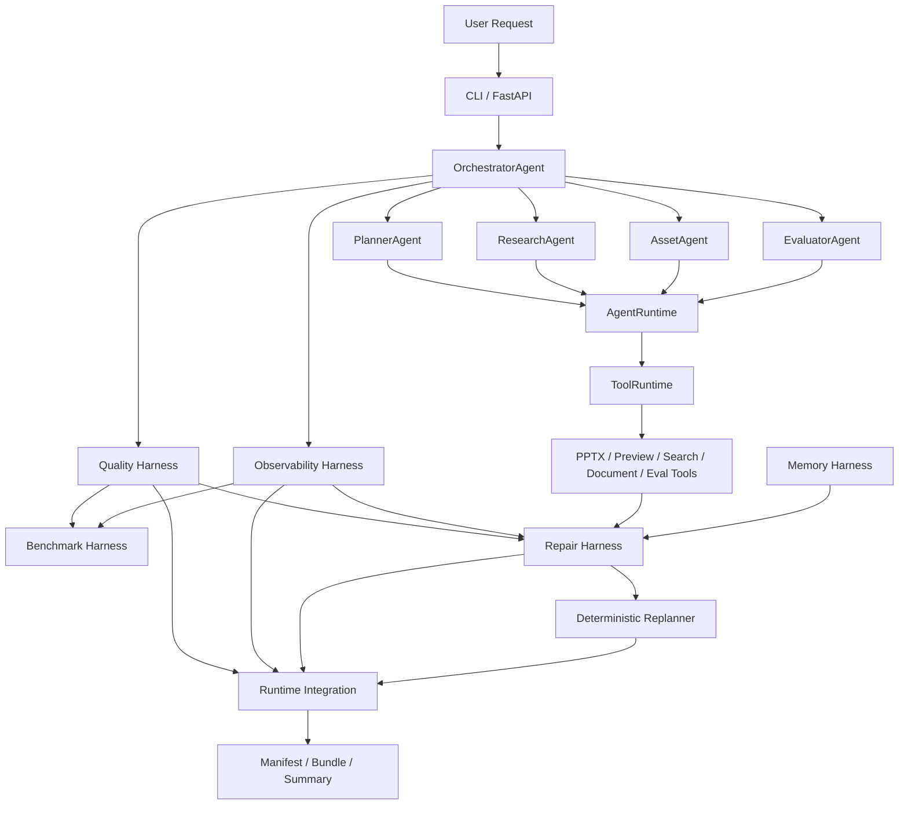

# Architecture Overview

## North Star

This project is not a fully autonomous multi-agent system. It is a controlled Agentic Workflow executed by a PPT Generation Agent Harness.

The harness exists to make document-to-PPT generation observable, measurable, repairable, reproducible, and easier to iterate without breaking the existing backend.

## Nine Harness Layers

## Data Flow

1. **Generate PPT**: CLI / FastAPI invokes the existing PPT generation backend. Orchestrator still controls the main flow.
2. **Quality**: Quality Harness extracts run-level and slide-level signals into `quality_report.json` and `quality_report.md`.
3. **Trace**: Observability writes trace events and summary artifacts.
4. **Benchmark**: Offline benchmark evaluates existing quality and trace artifacts over a benchmark suite.
5. **Memory**: Memory Harness can write episodic run memory and retrieve procedural repair knowledge.
6. **Repair**: Repair Harness converts quality issues, tool errors, trace status, and memory hits into repair plans.
7. **Replan**: Deterministic Replanner converts run signals into auditable PlanGraph patch proposals.
8. **Runtime Integration**: Post-run helper bundles available artifacts into `harness_manifest.json`, `harness_bundle.json`, and `harness_summary.md`.

## Layer Inputs and Outputs

| Layer | Main Inputs | Main Outputs |
|---|---|---|
| AgentRuntime | Worker implementation, `AgentRequest`, `AgentContext` | `AgentResult`, `agent.started`, `agent.finished` |
| ToolRuntime | `ToolCall`, registered tool handler | `ToolResult`, tool trace events |
| Quality | Generated PPT artifacts, preview/text/eval data | `quality_report.json`, `quality_report.md` |
| Observability | Trace records from workflow/harness modules | `trace.jsonl`, `trace_summary.json`, `trace_summary.md` |
| Benchmark | `quality_report.json`, `trace_summary.json`, suite JSON | `benchmark_report.json`, `case_results.jsonl` |
| Memory | Run artifacts or explicit memory records | JSONL memory records, memory trace events |
| Repair | Quality report, trace summary, tool errors, memory hits | `repair_plan.json`, `repair_report.md` |
| Replanner | Run signals, PlanGraph, repair artifacts | `plan_graph.json`, `replan_decision.json`, `replan_report.md` |
| Runtime Integration | Existing run artifacts | `harness_manifest.json`, `harness_bundle.json`, `harness_summary.md` |

## Why These Layers Help PPT Quality

- Quality reports make subjective PPT output inspectable through structured metrics.
- Trace events make tool and phase failures diagnosable after the run.
- Benchmarking turns a collection of runs into a repeatable regression surface.
- Memory preserves validated repair experience without relying on hidden prompts.
- Repair plans localize what should be fixed before attempting expensive regeneration.
- Deterministic replanning keeps control-flow suggestions auditable and conservative.
- Runtime bundles make a complete run easier to review in GitHub demos and interviews.

## Preservation Boundary

`ppt_backend/` and the existing `runtime/` flow remain the compatibility baseline. Harness modules should wrap, adapt, or analyze the run rather than rewrite the core generation path.
